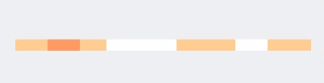

# trt-video-heatmap
We can generate heatmap with this library

add this script 

# To generate heat map

var map = new HeatMap([data in array], colorCode, id of element);

# Example : 

var colorCode = ['rgb(255, 245, 204)','rgb(255, 205, 143)','rgb(255, 155, 97)', 'rgb(255, 81, 46)',
	                        'rgb(255, 0, 0)', 'rgb(226, 0, 0)', 'rgb(191, 2, 2)', 'rgb(156, 1, 1)',
	                        'rgb(125, 2, 2)'];

var data = [1,1,1,1,1,2,2,2,2,1,1,1,3,3,3,3];

var map = new HeatMap(data, colorCode(optional), 'heatMap');

